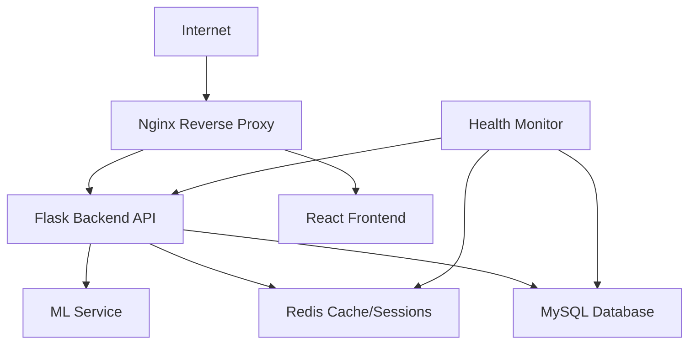

# Visitor Management System - Production Deployment Guide

## 🚀 Production Deployment Overview

This guide covers the complete production deployment of the Visitor Management System using Docker containers with enterprise-grade security, monitoring, and scalability features.

## 📋 Prerequisites

### System Requirements
- **OS**: Linux (Ubuntu 20.04+ recommended)
- **RAM**: Minimum 4GB, Recommended 8GB+
- **Storage**: Minimum 20GB free space
- **CPU**: 2+ cores recommended
- **Network**: Stable internet connection for SSL certificates

### Required Software
```bash
# Install Docker and Docker Compose
curl -fsSL https://get.docker.com -o get-docker.sh
sudo sh get-docker.sh
sudo usermod -aG docker $USER

# Install Docker Compose
sudo curl -L "https://github.com/docker/compose/releases/latest/download/docker-compose-$(uname -s)-$(uname -m)" -o /usr/local/bin/docker-compose
sudo chmod +x /usr/local/bin/docker-compose

# Verify installation
docker --version
docker-compose --version
```

## 🔧 Environment Configuration

### 1. Environment Variables Setup
```bash
# Copy and configure environment file
cp .env.production.example .env.production

# Edit with your production settings
nano .env.production
```

### 2. Required Environment Variables
| Variable | Description | Example |
|----------|-------------|---------|
| `SECRET_KEY` | Flask secret key | `your-super-secret-key-here` |
| `DATABASE_PASSWORD` | MySQL root password | `secure-db-password` |
| `JWT_SECRET_KEY` | JWT token secret | `jwt-secret-key` |
| `EMAIL_USERNAME` | SMTP email username | `notifications@yourdomain.com` |
| `EMAIL_PASSWORD` | SMTP email password | `your-email-password` |
| `DOMAIN_NAME` | Your domain name | `vms.yourdomain.com` |

## 🔐 SSL Certificate Setup

### Option 1: Self-Signed Certificates (Development/Testing)
```bash
# Generate self-signed certificates
chmod +x generate-ssl.sh
./generate-ssl.sh
```

### Option 2: Let's Encrypt (Production)
```bash
# Configure domain in ssl/letsencrypt-setup.sh
nano ssl/letsencrypt-setup.sh

# Generate production certificates
cd ssl
chmod +x letsencrypt-setup.sh
./letsencrypt-setup.sh
```

## 🏗️ Deployment Process

### 1. Initial Deployment
```bash
# Make deployment script executable
chmod +x deploy.sh

# Deploy the application
./deploy.sh
```

### 2. Deployment Steps Explained
The deployment script performs:
1. **Environment Validation**: Checks required files and variables
2. **SSL Certificate Setup**: Generates or validates certificates
3. **Database Initialization**: Creates database schema and initial data
4. **Container Build**: Builds optimized Docker images
5. **Service Orchestration**: Starts all services with health checks
6. **Security Validation**: Verifies security configurations
7. **Health Monitoring**: Ensures all services are running properly

### 3. Service Architecture


## 🔍 Service Configuration

### Backend Service (Flask API)
- **Framework**: Flask with Gunicorn WSGI server
- **Workers**: Auto-scaled based on CPU cores
- **Security**: Rate limiting, CORS, input validation
- **Monitoring**: Health checks, metrics collection
- **Logging**: Structured logging with rotation

### Frontend Service (React)
- **Build**: Optimized production build
- **Server**: Nginx for static file serving
- **Security**: Security headers, HTTPS redirect
- **Caching**: Browser caching for static assets

### Database Service (MySQL)
- **Version**: MySQL 8.0
- **Configuration**: Production-optimized settings
- **Security**: Non-root user, network isolation
- **Backup**: Automated backup scripts included
- **Monitoring**: Health checks and performance metrics

### Nginx Reverse Proxy
- **SSL/TLS**: Handles SSL termination
- **Load Balancing**: Distributes traffic to backend
- **Security**: Rate limiting, DDoS protection
- **Compression**: Gzip compression for better performance

### Redis Cache
- **Purpose**: Session storage and application caching
- **Configuration**: Optimized for performance
- **Security**: Password protection, network isolation
- **Monitoring**: Memory usage and connection metrics

## 📊 Monitoring & Health Checks

### Automated Health Monitoring
```bash
# Start health monitoring (runs every 30 seconds)
chmod +x health-check.sh
./health-check.sh
```

### Service Health Endpoints
- **Backend API**: `https://yourdomain.com/api/health`
- **Database**: Internal health check via backend
- **Redis**: Connection health via backend
- **Frontend**: HTTP status check

### Monitoring Features
- **Service Status**: Real-time service availability
- **Performance Metrics**: Response times, throughput
- **Resource Usage**: CPU, memory, disk usage
- **Alert System**: Email notifications for issues
- **Log Aggregation**: Centralized logging with rotation

## 🔒 Security Features

### Network Security
- **HTTPS Only**: All traffic encrypted with SSL/TLS
- **Security Headers**: Comprehensive security header set
- **Rate Limiting**: API and frontend rate limiting
- **CORS Protection**: Configured cross-origin policies

### Application Security
- **Input Validation**: Server-side validation for all inputs
- **SQL Injection Protection**: Parameterized queries
- **XSS Protection**: Content Security Policy headers
- **Authentication**: JWT-based secure authentication
- **Session Security**: Secure session management with Redis

### Container Security
- **Non-Root Users**: All containers run as non-root
- **Image Scanning**: Multi-stage builds for minimal attack surface
- **Network Isolation**: Service-specific networks
- **Secret Management**: Environment-based secret handling

## 🔧 Maintenance Operations

### Backup Database
```bash
# Manual backup
docker-compose -f docker-compose.prod.yml exec mysql mysqldump -u vms_user -p visitor_management_prod > backup_$(date +%Y%m%d_%H%M%S).sql

# Automated backup (already configured in docker-compose)
# Backups stored in ./database/backups/
```

### View Logs
```bash
# All services
docker-compose -f docker-compose.prod.yml logs -f

# Specific service
docker-compose -f docker-compose.prod.yml logs -f backend
```

### Update Application
```bash
# Pull latest changes
git pull origin main

# Rebuild and restart
docker-compose -f docker-compose.prod.yml down
docker-compose -f docker-compose.prod.yml up --build -d
```

### Scale Services
```bash
# Scale backend workers
docker-compose -f docker-compose.prod.yml up -d --scale backend=3

# Scale based on load
docker-compose -f docker-compose.prod.yml up -d --scale backend=5
```

## 🚨 Troubleshooting

### Common Issues

#### Services Not Starting
```bash
# Check service status
docker-compose -f docker-compose.prod.yml ps

# Check specific service logs
docker-compose -f docker-compose.prod.yml logs backend
```

#### Database Connection Issues
```bash
# Verify database is running
docker-compose -f docker-compose.prod.yml exec mysql mysql -u vms_user -p

# Check database initialization
docker-compose -f docker-compose.prod.yml logs mysql
```

#### SSL Certificate Issues
```bash
# Verify certificate files
ls -la ssl/

# Check certificate validity
openssl x509 -in ssl/server.crt -text -noout
```

#### Performance Issues
```bash
# Monitor resource usage
docker stats

# Check health monitoring
./health-check.sh --verbose
```

### Emergency Procedures

#### Service Recovery
```bash
# Restart all services
docker-compose -f docker-compose.prod.yml restart

# Force recreate containers
docker-compose -f docker-compose.prod.yml down
docker-compose -f docker-compose.prod.yml up -d --force-recreate
```

#### Database Recovery
```bash
# Restore from backup
docker-compose -f docker-compose.prod.yml exec mysql mysql -u vms_user -p visitor_management_prod < backup_file.sql
```

## 📈 Performance Optimization

### Recommended Optimizations
1. **Load Balancing**: Use multiple backend instances
2. **CDN**: Implement CDN for static assets
3. **Database Tuning**: Optimize MySQL configuration
4. **Caching**: Implement Redis caching strategies
5. **Monitoring**: Set up comprehensive monitoring

### Scaling Guidelines
- **Traffic < 1000 users**: Current setup sufficient
- **Traffic 1000-10000 users**: Scale backend to 3-5 instances
- **Traffic > 10000 users**: Consider microservices architecture

## 🔄 CI/CD Integration

### GitHub Actions Example
```yaml
name: Production Deployment
on:
  push:
    branches: [main]
jobs:
  deploy:
    runs-on: ubuntu-latest
    steps:
      - uses: actions/checkout@v2
      - name: Deploy to production
        run: |
          ssh user@server 'cd /path/to/app && git pull && ./deploy.sh'
```

## 📞 Support & Maintenance

### Regular Maintenance Tasks
- **Weekly**: Review logs and performance metrics
- **Monthly**: Update dependencies and security patches
- **Quarterly**: Full security audit and backup testing

### Monitoring Alerts
- Service downtime alerts
- High resource usage alerts
- Failed login attempt alerts
- Database performance alerts

### Contact Information
- **System Administrator**: [Your Email]
- **Emergency Contact**: [Emergency Number]
- **Documentation**: [Documentation URL]

---

## 🎯 Quick Start Checklist

- [ ] Configure environment variables in `.env.production`
- [ ] Generate SSL certificates (`./generate-ssl.sh`)
- [ ] Run deployment script (`./deploy.sh`)
- [ ] Verify all services are running
- [ ] Test application functionality
- [ ] Set up monitoring alerts
- [ ] Configure backup schedule
- [ ] Document custom configurations

**🎉 Congratulations! Your Visitor Management System is now running in production with enterprise-grade security and monitoring.**
